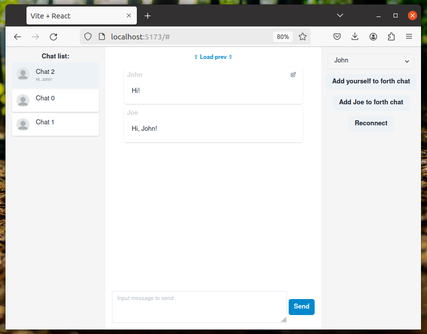
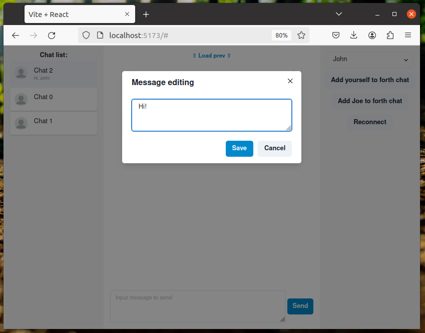

# FastAPI+ReactJS chat

This project implements the chat functionality on Python and ReactJS that can be adjusted and extended according to your needs.

This is generally my study project, but I hope it can be useful for somebody. **Any feedback is appritiated!**

**Already implemented:**

✅ Requesting and displaying user's chat list

✅ Adding user to the chat

✅ Loading last XX messages on chat open

✅ Loading previous chat messages by clicking the button

✅ Sending and receiving messages to the chat

✅ Editing own chat messages

✅ Displaying last messages in the chat list for each chat

**Future plans:**

 - Code review and refactoring

 - User registration and authorization

 - Chat creation functionality

 - User list with filters

 - Message status (is delivered, is read)

 - Displaying the new (unread) message count in chat list

 - Packaging servers into docker images

**This project is licensed under the terms of the MIT license.**
